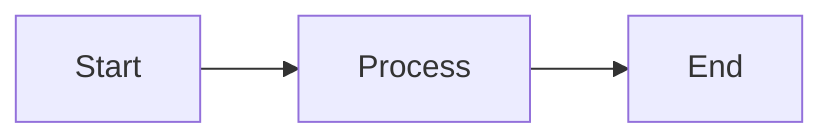

# Usage Guide

This guide covers day-to-day usage of {{ cookiecutter.project_name }}: managing documentation and presentations.

For installation and environment setup, see [`docs/installation.md`](installation.md).

## Typical Workflow

### Documentation Workflow

1. Write or edit documentation in `mkdocs/docs/`
2. Start the dev server to preview changes
3. Update `mkdocs/mkdocs.yml` if adding new pages
4. Build static HTML when ready to deploy
5. Commit changes using Conventional Commits

### Presentation Workflow

1. Create a new presentation or edit existing one
2. Edit slides in markdown
3. Start the dev server to preview
4. Test in presenter mode
5. Export to PDF for distribution
6. Commit changes

## CLI Reference

### MkDocs Commands

Start development server:
```bash
py-docs mkdocs start
```

Build static HTML:
```bash
py-docs mkdocs build
```

Stop server:
```bash
py-docs mkdocs stop
```

### Slidev Commands

List presentations:
```bash
py-docs slidev list
```

Create new presentation:
```bash
py-docs slidev create <name>
```

Start presentation:
```bash
py-docs slidev start [name]
```

Export to PDF:
```bash
py-docs slidev export [name]
```

Stop server:
```bash
py-docs slidev stop
```

Open in browser:
```bash
py-docs slidev open
```

Build Docker image:
```bash
py-docs slidev build
```

## Working with Documentation

### Adding New Pages

1. Create a markdown file in `mkdocs/docs/`:

```bash
touch mkdocs/docs/my-page.md
```

2. Edit the file with your content

3. Add to navigation in `mkdocs/mkdocs.yml`:

```yaml
nav:
  - Home: index.md
  - My New Page: my-page.md
```

### Using Markdown Features

#### Admonitions

```markdown
!!! note "Note Title"
    This is a note.

!!! warning
    Be careful!

!!! tip "Pro Tip"
    Here's a tip!
```

#### Code Blocks

````markdown
```python
def hello():
    print("Hello, World!")
```
````

#### Mermaid Diagrams

````markdown

````

#### Tabbed Content

```markdown
=== "Python"
    ```python
    print("Hello")
    ```

=== "JavaScript"
    ```javascript
    console.log("Hello");
    ```
```

### Building for Deployment

Build static HTML:
```bash
py-docs mkdocs build
```

The output will be in `mkdocs/site/`. Deploy this directory to:
- GitHub Pages
- Netlify
- Vercel
- AWS S3
- Any static hosting service

## Working with Presentations

See the detailed [Slidev Guide](SLIDEV.md) for comprehensive information.

### Quick Start

Create a presentation:
```bash
py-docs slidev create my-talk
```

Edit `slides/my-talk/slides.md`:
```markdown
---
theme: seriph
---

# My Talk

Introduction

---

# Agenda

- Point 1
- Point 2
- Point 3
```

Start the server:
```bash
py-docs slidev start my-talk
```

### Presenter Mode

When presenting, press `o` to enter overview mode, or `g` to go to a specific slide.

## Dependency Management

Add Python dependencies with Poetry:

```bash
poetry add <package>
poetry add --group dev <dev_package>
```

For Slidev presentations, add Node dependencies in the presentation directory:

```bash
cd slides/my-presentation
npm install <package>
```

## Code Quality

Pre-commit hooks are configured for:
- Python: ruff, mypy, bandit, detect-secrets
- Markdown: markdownlint
- HTML/CSS: htmlhint, stylelint
- Security: detect-secrets, bandit
- Git: commitizen

Run all hooks manually:

```bash
poetry run pre-commit run -a
```

Install hooks to run automatically:

```bash
poetry run pre-commit install
```

## Docker

The project uses Docker for both MkDocs and Slidev. Docker images are built automatically when starting services.

Manually build images:

```bash
py-docs slidev build
# or
cd .build && docker build -t {{ cookiecutter.__project_slug }}-mkdocs:latest -f mkdocs.Dockerfile .
```

## Versioning and Releases

- Use Conventional Commits: `feat:`, `fix:`, `docs:`, `chore:`, etc.
- Versioning managed by `python-semantic-release` (configured in `pyproject.toml`)

## Tips and Best Practices

### Documentation

1. **Keep it Updated** - Update docs as you make changes
2. **Use Examples** - Code examples are more helpful than descriptions
3. **Link Liberally** - Cross-reference related pages
4. **Test Links** - Ensure all links work before deploying
5. **Use Admonitions** - Highlight important information

### Presentations

1. **One Point Per Slide** - Keep slides focused
2. **Use Visuals** - Images and diagrams over text
3. **Practice** - Use presenter mode to practice timing
4. **Export Early** - Test PDF export before presenting
5. **Keep Source** - Version control your presentations

## Troubleshooting

### Port Already in Use

Stop the conflicting server:
```bash
py-docs mkdocs stop
py-docs slidev stop
```

### Docker Issues

Rebuild images:
```bash
py-docs slidev build
```

Or manually:
```bash
cd .build
docker build -t {{ cookiecutter.__project_slug }}-slidev:latest -f slidev.Dockerfile .
docker build -t {{ cookiecutter.__project_slug }}-mkdocs:latest -f mkdocs.Dockerfile .
```

### Permission Errors

On Linux, ensure your user has Docker permissions:
```bash
sudo usermod -aG docker $USER
```

Then log out and back in.

## Next Steps

- Read the [Slidev Guide](SLIDEV.md) for detailed presentation instructions
- Explore [MkDocs Material](https://squidfunk.github.io/mkdocs-material/) for more features
- Check out [Slidev documentation](https://sli.dev/) for advanced techniques
