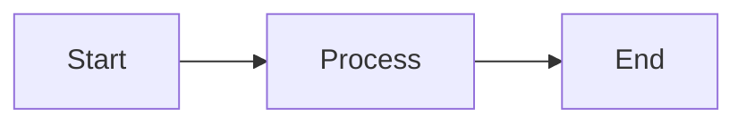

# MkDocs Documentation

This directory contains the MkDocs documentation source files for {{ cookiecutter.project_name }}.

## Structure

```
mkdocs/
├── mkdocs.yml          # MkDocs configuration
├── docs/               # Documentation source files
│   ├── index.md       # Home page
│   └── getting_started/
│       ├── installation.md
│       └── quickstart.md
└── site/              # Generated static site (after build)
```

## Usage

### Start Development Server

```bash
py-docs mkdocs start
```

This will start a local server at `http://localhost:8000` with hot-reload enabled.

### Build Static Site

```bash
py-docs mkdocs build
```

The static HTML files will be generated in the `site/` directory.

### Stop Server

```bash
py-docs mkdocs stop
```

## Writing Documentation

### Creating New Pages

1. Create a new `.md` file in the `docs/` directory
2. Add the page to the `nav` section in `mkdocs.yml`
3. Write your content using Markdown

### Markdown Features

This documentation supports:

- **Basic Markdown**: headings, lists, links, images, code blocks
- **Admonitions**: callout blocks for notes, warnings, tips
- **Code syntax highlighting**: for multiple languages
- **Math equations**: using LaTeX syntax
- **Mermaid diagrams**: for flowcharts and diagrams
- **Tabbed content**: for multiple code examples
- **Task lists**: checkboxes in lists
- And more!

### Example Admonition

```markdown
!!! note "This is a note"
    This is the content of the note.

!!! warning "Warning"
    Be careful with this!

!!! tip "Pro Tip"
    Here's a helpful tip!
```

### Example Code Block

````markdown
```python
def hello_world():
    print("Hello, World!")
```
````

### Example Mermaid Diagram

````markdown

````

## Configuration

The `mkdocs.yml` file controls:

- Site metadata (name, description, author)
- Theme and appearance
- Navigation structure
- Markdown extensions
- Plugins
- And more

See the [MkDocs documentation](https://www.mkdocs.org/) for full configuration options.

## Theme

This project uses the [Material for MkDocs](https://squidfunk.github.io/mkdocs-material/) theme, which provides:

- Beautiful, responsive design
- Dark mode support
- Search functionality
- Navigation enhancements
- Many Markdown extensions
- And more

## Deployment

The built site in `site/` can be deployed to:

- GitHub Pages
- Netlify
- Vercel
- AWS S3
- Any static hosting service

See the [MkDocs deployment documentation](https://www.mkdocs.org/user-guide/deploying-your-docs/) for details.

